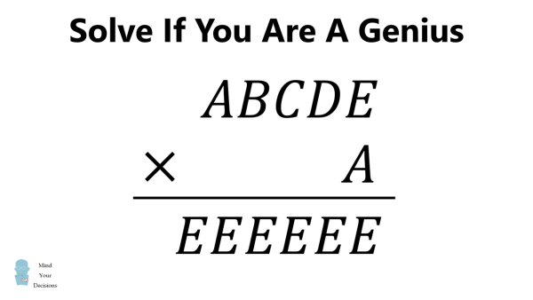

# puzzleFromTaiwan
random solution for Taiwan puzzle

Someone sent me this awhile ago. After spending about 5 minutes poking around at figuring out the problem, rather than looking up the answer online, I said 'screw' this and typed up a program to be ran in a javascript console. (the person, who has an undergraduate degree in math solved it before I did...)

#########################################

to run my 'solution' which is just bruteforcing the answer, copy and paste into a javascript console

#########################################
The actual solution is here: https://mindyourdecisions.com/blog/2020/09/25/puzzle-from-taiwan-abcde-x-a-eeeeee/

Answer To Puzzle From Taiwan
(Pretty much all posts are transcribed quickly after I make the videos for them–please let me know if there are any typos/errors and I will correct them, thanks).

If A = 1, then we would have ABCDE × 1 = ABCDE ≠ EEEEEE.

Thus we have A ≠ 1.

From here we can focus on the units digit multiplication. We know E × A has a units digit equal to E.

We can easily work out (or consult a times table) to limit the number of possibilities. This only happens for:

A = 6 ≠ E
(A, E) = (2, 6), (4, 6), (8, 6)

E = 5 ≠ A
(A, E) = (3, 5), (7, 5), (9, 5)

Since ABCDE × A = EEEEEE, we have EEEEEE/A = ABCDE. From each value of E and A we cna work out the division problem to see if we get a five digit number with five different digits.

(A, E) = (2, 6)
222222/6 = 37037

(A, E) = (4, 6)
444444/6 = 74074

(A, E) = (8, 6)
888888/6 = 148148

(A, E) = (3, 5)
555555/3 = 185185

(A, E) = (7, 5)
555555/7 = 79365

(A, E) = (9, 5)
555555/9 = 61728 + 1/3

The only possibility that works is (A, E) = (7, 5) with 555555/7 = 79365 = ABCDE.

Thus A = 7, B = 9, C = 3, D = 6, and E = 5.

